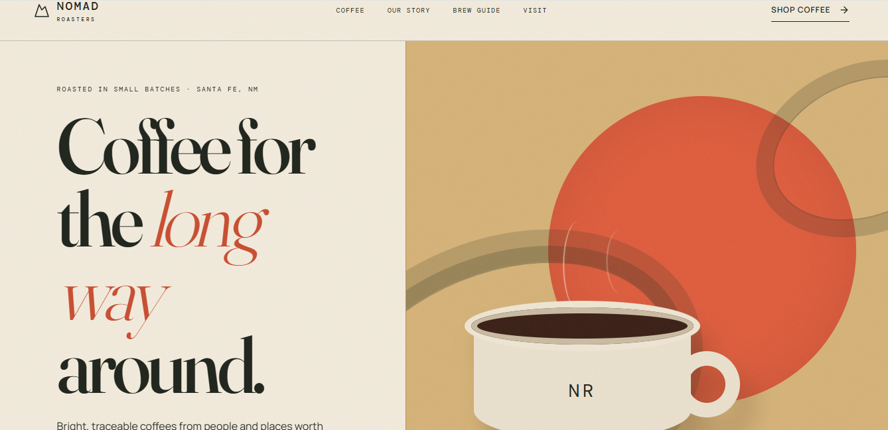

# Nomad Roasters — Coffee Brand Landing Page

A fully responsive landing page concept for a small-batch coffee roastery, built from scratch with HTML, CSS, and JavaScript — no templates or frameworks.

**[View Live Site →](https://yourusername.github.io/coffee-roastery-landing-page/)**



## What this project demonstrates

- **Responsive design** — clean layout across mobile, tablet, and desktop breakpoints
- **Custom design system** — a self-contained color palette, type scale, and component style rather than a generic template look
- **Interactivity** — a working email signup form with JS validation, scroll-triggered reveal animations, and hover states
- **Accessibility basics** — visible keyboard focus states, `prefers-reduced-motion` support
- **Clean, commented code** — organized CSS with consistent naming, no framework dependencies

## Tech stack

- HTML5
- CSS3 (custom properties, CSS Grid, Flexbox)
- Vanilla JavaScript (DOM events, IntersectionObserver)
- Google Fonts (Fraunces, Inter, JetBrains Mono)

## Structure

```
coffee-roastery-landing-page/
├── index.html      # all markup, styles, and scripts (single-file build)
└── README.md
```

## Run it locally

Clone the repo and open `index.html` in any browser — no build step or dependencies required.

```bash
git clone https://github.com/yourusername/coffee-roastery-landing-page.git
cd coffee-roastery-landing-page
open index.html
```

---

Built as a portfolio project by [Your Name](https://www.upwork.com/freelancers/~yourprofile) — front-end developer available for freelance web projects.
